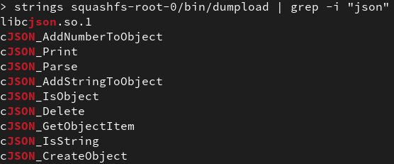
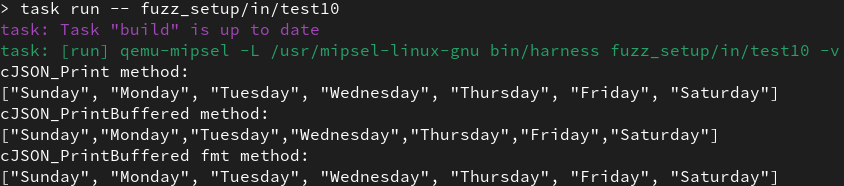
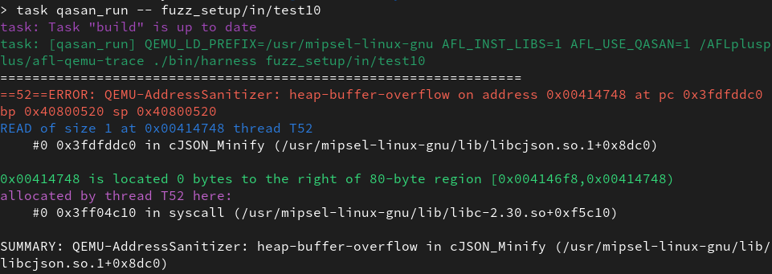
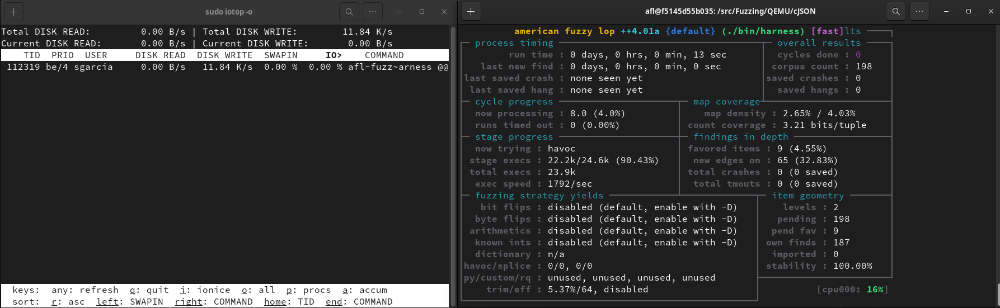
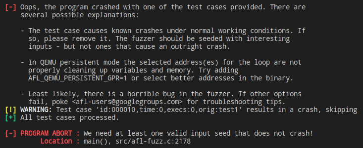

# Fuzzing the cJSON library
## Introduction 📖
cJSON is an ultralightweight JSON parser written in ANSI C. Given its small footprint, it is commonly used in embedded systems to help with making use of JSON formatted data.

This library was found while taking a look into a firmware package from an IP camera from the [Wyze](https://www.wyze.com/) brand, the [Wyzecam V3](https://www.wyze.com/products/wyze-cam).


This library was used by multiple core utilities implemented by the people at Wyze for this device's firmware. Upon inspection, the Wyzecam V3 is a MIPSel based device that uses GNU/Linux (with a pretty dated kernel version 3.10.14) as its Operative System and uClibC as its C standard library.

These utilities can be easily identified by extracting with Binwalk a firmware update package for the device and then inspecting the obtained binaries.




## Interest 💡
This library was of special interest mainly due to being:
- A **pretty popular** choice for IoT/embedded firmware developers to handle JSON.
- A **possible attack surface** given that it handles external data when parsing.
- Compiled for **MIPSel**. There is a wide range of IoT/embedded devices that use the MIPS(el) or ARM architecture. This could serve as a learning exercise to fuzz code compiled for those architectures.
- An **Open-Source project**. Given that these are our first steps into reversing and fuzzing code from these kinds of devices, this could help us understand possible found "crashes" by not depending solely on the decompiled code obtained from the library. Although having the code at our disposal would allow us to recompile it targeting our host architecture, focusing on working with the extracted library gives us an opportunity to grasp the basics of cross-architecture reversing and fuzzing while also being able to look up the original source code.

## Usage 🧭
In order to facilitate the reproducibility of the developed examples, a taskfile and a docker container have been provided. This taskfile will help mainly with the following tasks:
- **Building the fuzzing harness**: Since we are dealing with a C library in the form of a shared object (.so) file, a fuzzing harness is used to make calls to the functions of the library. A task is provided to automate the compilation of a dynamically linked fuzzing harness targeting the MIPSel architecture. For example:
    ```console
    foo@bar:~$ task build
    ```
- **Running the fuzzing harness**: This can be done via two different tasks. A first one that uses plain QEMU's user mode emulation to emulate the execution of the binary and a second one that makes use of AFL++'s builtin [QASAN](https://github.com/AFLplusplus/AFLplusplus/tree/dev/qemu_mode/libqasan) library to easily detect memory errors. For example:
    ```console
    foo@bar:~$ task qasan_run -- <input_file.json>
    ```
- **Fuzzing**: Three different ways of fuzzing the library have been included in the taskfile. One simply uses AFL++ in QEMU mode, the second one also enables QASAN while fuzzing to aid with the detection of memory errors by crashing as soon as one is detected, even if under normal circumstances these errors do not seem to affect the behavior of the program. Lastly, a third fuzzing mode has been added where a ramdisk is used to store and read temp files in order to alleviate the I/O strain on the disk.
    ```console
    foo@bar:~$ task ramdisk_fuzz
    ```

## Results 📔
### Emulation
Before getting any fuzzing done, we need to ensure that the binary is being properly **emulated** in our x64 host machine. After a bit of tinkering to iron out some compilation issues when linking the needed libraries, the binary is properly running!



<br>When trying to run the harness with **QASAN**, some memory-related errors inside cJSON's code were instantly reported back regardless of the used input JSON file. This issue will be comprehensively discussed in the thesis' document. 



### Fuzzing
The following main discoveries were made while fuzzing the library.

- It was observed that this fuzzing test case was heavy on the I/O usage. The iotop utility reports an average of 7MB/s disk writes as soon as the fuzzing process starts. This kind of workload can severely reduce the lifespan of the disk if run for hours or even days so a ramdisk was used. After switching to a ramdisk to store in RAM the temporary files used in the fuzzing process, the I/O total disk write dropped to an average of 20KB/s.



- After a few minutes of fuzzing the harness some crashes started to show up in AFL++'s interface, but none of these crashes could be reproduced afterwards. Leveraging the fact that we have access to the source code of the library, a second binary was compiled targeting x64 this time. Surprisingly, this one did not crash once after fuzzing for hours so we can conclude that there must be a bug in the AFL++'s QEMU MIPS implementation. An issue will be created in [AFL++'s Github](https://github.com/AFLplusplus/AFLplusplus) repository and everything needed to reproduce the issue will be provided.
- As we mentioned before, QASAN always detects memory errors and thus crashes when running the harness regardless of the JSON input file used. As a consequence, fuzzing using QASAN becomes impossible due to the fact that every test run that AFL++ performs prior to fuzzing crashes with memory errors and the fuzzing process cannot start.

    