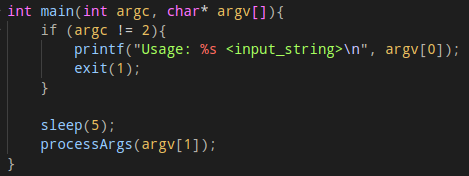
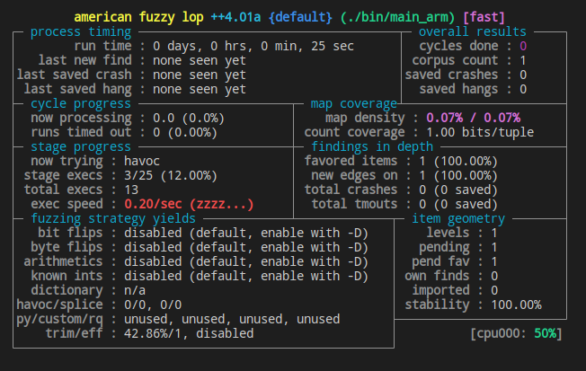
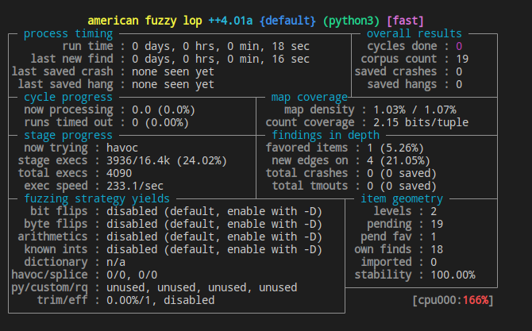

# Qiling binary emulation framework Proof of Concept
## Introduction 📖
<br>
[Qiling](https://github.com/qilingframework/qiling) is an advanced binary emulation framework built on top of the [Unicorn engine](https://www.unicorn-engine.org/). In contrast to Unicorn, Qiling is designed as a higher level framework that not only is capable of emulating CPU instructions from different architectures but also works with different OS level concepts such as syscalls, IO handlers, libraries and more.

This is a proof of concept to exhibit some of what the Qiling framework has to offer when it comes to emulating, patching and fuzzing binaries, more specifically problematic binaries that can be quite hard to successfully emulate in QEMU. Most of the time, these issues stem from the fact that the binaries that are usually found in embedded devices have pretty strict hardware / running environment requirements that can't be easily met. 

This simple proof of concept represents an interesting example since our target binary simulates the presence of code that would make traditional fuzzing work at non acceptable speeds. This can be solved thanks to Qiling's capabilities to dynamically patch the execution of the binary to emulate/fuzz only the sections of code we are interested in.

## Interest 💡
Getting started with Qiling is of special interest for our case study due to:
- **Multi architecture support**: Given that our focus is on working with embedded/IoT platforms, being able to perform fine-grain binary instrumentation for both ARM and MIPS architectures with a single framework is extremely helpful.
- **Easy debugging**: Once a crash is found by fuzzing, the next step is starting the crash triage process. Debugging how the binary behaves with certain crashing inputs is essential when trying to determine the root cause for the crash. Qiling allows easy debugging through GDB and its memory, register and OS level API.
- **On the fly code patching**: Binaries that abort their execution when detecting missing devices such as network interfaces, sockets, additional partitions, etc. are pretty common in embedded firmwares. Qiling alleviates this issue by allowing us to dynamically patch the execution of binaries through setting hooks, changing register and memory values, mapping memory, setting the execution entry point, etc.

## Usage 🧭
In order to facilitate the reproducibility of the developed examples, a taskfile and a docker container have been provided. This taskfile will help mainly with the following tasks:
- **Building the fuzzing harness**: A task is provided to automate the compilation of the target binary to be fuzzed targeting the ARM architecture. This binary will cipher an input string after sleeping for a few seconds. The pause before working with the input string represents the execution of preliminary tasks in real world binaries that can slow down or interfere with the execution of our target code.


    ```console
    foo@bar:~$ task build
    ```
- **Running the fuzzing harness**: This can be done via two different tasks. A first one that uses plain QEMU's user mode emulation to emulate the execution of the whole binary and a second one that makes use of a Qiling script to jump straight to our target code. For example:

    ```console
    foo@bar:~$ task qiling_run -- <input_string>
    ```
- **Fuzzing**: Two different ways of fuzzing the binary have been included in the taskfile. One simply uses AFL++ in QEMU mode while the second one uses AFL++ in Unicorn mode with a Qiling script thus fuzzing only our target code instead of the whole binary.

    ```console
    foo@bar:~$ task qiling_fuzz
    ```

## Results 📔
### Emulation
Emulating such a simple binary with Qiling is pretty straight forward. In order to jump straight to our target code, two hooks where used. A first one that replaces the first parameter which is used to call the "__libc_start_main" initialization function with. This parameter represents the memory address of the function that will become the main function of the program. Then, another hook is put in place to map the input string to memory and place its address in the proper registry so the function is properly executed.

The only aspect of the process that caused some confusion at first was that when trying to force a crash by trying to read from NULL no crashes appeared. The explanation behind this is that reading from a NULL address is equivalent to reading from 0x0 and due to the fact that when asked to map data anywhere to memory, Qiling usually starts mapping at that address, 0x0 becomes a valid address to read bytes from.

### Fuzzing
As expected, fuzzing this binary with standard AFL++ in QEMU mode was unfeasible, with execution speeds of 0.2 executions per second. Fuzzing at this speed would make finding even the most simple crash a multi-day task.



On the other hand, using Qiling to fuzz this binary shows an abysmal difference in execution speed thanks to being able to skip directly to the "processArgs" function.



By using this technique, AFL++ was able to found the crash in less than one minute.