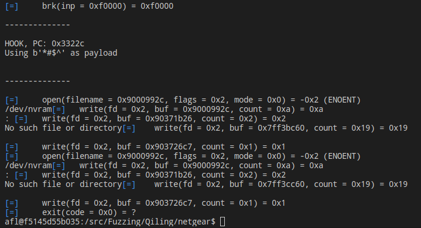
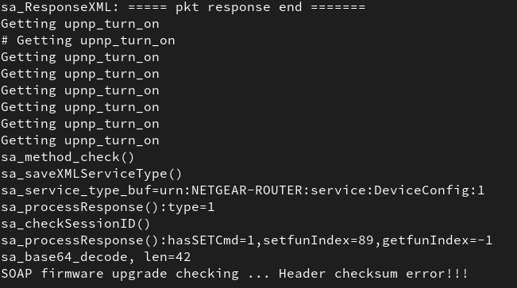
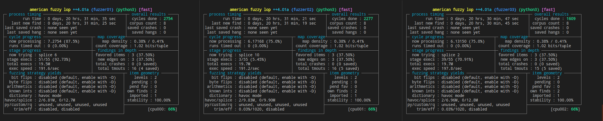
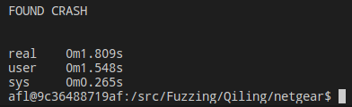
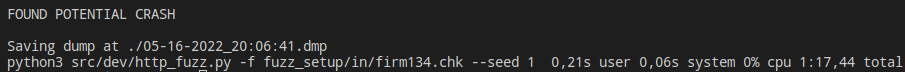

# Fuzzing Netgear R7000's firmware upgrade process
## Introduction 📖
The Netgear R7000 also known as the Nighthawk AC1900 is a considerably popular "smart" Wifi router released in 2021 that is actively maintained with frequent updates to this day.


After going through [GRIMM's](https://blog.grimm-co.com/2022/04/no-hardware-no-problem-emulation-and.html) post on some recently discovered vulnerabilities for the R7000, it seemed like the perfect candidate to do some further research on finding and analyzing vulnerabilities through fuzzing and other emulation methods such as Qiling and Unicorn. Our main focus here will be the discussed stack overflow found in the UPnP daemon firmware upgrade process. This stack overflow is caused by a call to *memcpy* that gets the number of bytes to copy from hardcoded values included in the firmware update package.
## Interest 💡
Using this vulnerability as our research topic was of special interest due to:

- **Real vulnerability**: Being able to get hands on with a real vulnerability allows us to learn more about how these kinds of real world vulnerabilities can be found and later investigated on commonly available devices.
- **Static and dynamic vulnerability analysis**: Fuzzing is not only about finding a crash and calling it a day. Some degree of analysing the crash is also needed in order to determine the severity of the potential vulnerability. This example allows us to get some knowledge on code analysis using the Ghidra decompiler while also using GDB with Qiling or QEMU for dynamic analysis.
- **Fuzzing approach comparison**: In GRIMM's blog post, only QEMU system emulation is discussed. This allows us to take the aforementioned vulnerability as a starting point and experiment with alternative approaches when it comes to finding finding it. The alternative approaches that will be applied here are fuzzing with **Qiling and AFL++**, fuzzing with **Qiling and Radamsa** as the input mutator and lastly emulating the binary with QEMU system emulation to then fuzz it through **HTTP requests mutated by Radamsa**.

## Usage 🧭
In order to facilitate the reproducibility of the developed examples, two taskfiles (one for Qiling and one for [QEMU](../../QEMU/netgear/Taskfile.yml)) and a docker container have been provided. These taskfiles will help mainly with the following tasks:

- **Fuzzing with AFL++ and Qiling**: The following task allows to fuzz the *abCheckBoardID* function using a Qiling script and AFL++ in Unicorn mode while obtaining instrumentation output.
    ```console
    foo@bar:~$ task afl_fuzz
    ```

- **Fuzzing with Radamsa and Qiling**: This task uses a similar Qiling script to emulate the function but uses a "dumb" fuzzing approach with Radamsa as the mutator to emulate the function repeatedly until a crash is found.
    ```console
    foo@bar:~$ task radamsa_fuzz -- <initial_input>
    ```

- **Fuzzing with Radamsa and HTTP requests**: This last task assumes that the UPnP daemon is up and running (be it by emulation on QEMU or running on real hardware) and performs fuzzing via HTTP requests that contain firmware update packages that have been mutated by Radamsa.
    ```console
    foo@bar:~$ task http_fuzz -- <initial_input>
    ```

## Results 📔
### Emulation
Before getting any fuzzing done, we need to ensure that the binary is being properly **emulated** in our x64 host machine. Setting up emulation with both techniques (Qiling and QEMU system) was easy enough. For Qiling, a few modifications to the [Proof Of Concept emulation](../PoC/src/emulate.py) script were needed to get it running.



QEMU system emulation was also pretty straight forward following the indications on GRIMM's blog post. Once the Debian VM was running all it was needed to get the daemon running was to use the provided libnvram faker shared object and patch the execution with GDB so the daemon doesn't abort due to network configuration mismatch.



### Fuzzing
- **Fuzzing with AFL++ and Qiling**: Using a Qiling script with the unicornafl python bindings proved to be the least effective solution. While the emulation part worked fine, there seemed to be a bug in how the Qiling AFL++ integration is implemented that made it impossible for the function to crash while fuzzing, even with the same inputs that crashed when using the emulation script. Although reverting back to the quite dated Qiling stable branch fixed the crashes not being registered when using the fuzzing script, no crashes were detected when fuzzing with AFL++ yet after fuzzing in parallel mode with 3 instances for 20 hours.


After some debugging with the flag *AFL_DEBUG_CHILD* it was apparent that the mutator had some difficulty creating a mutated input that had a null byte separating the initial magic string ("**\*#$^**") from the rest of the header data. If the fourth byte of the input is manually set to zero in the python script, AFL++ is able to find the crash instantly.

- **Fuzzing with Radamsa and Qiling**: This was the fastest choice by far for this use case. Using Qiling to emulate the function and Radamsa to mutate the function input data, it only took less than a minute to find the crash.

    

- **Fuzzing with Radamsa and HTTP requests**: As predicted, this approach is not as fast as directly emulating the function since the whole daemon needs to be emulated and the HTTP requests need to be handled, but it also managed to find the crash in a more than reasonable amount of time.

    
